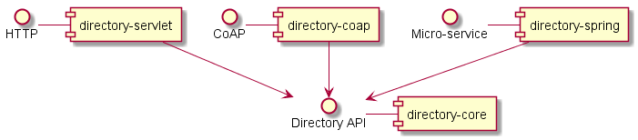

# thingweb-directory

The repository is archived due to no interest in further development. If you are looking for a TD Directory, have a look at the list at <https://www.w3.org/WoT/developers/#tdds>. 
[Eclipse Thingweb](https://github.com/eclipse-thingweb) is planning to have another one in the future.

The Thingweb Directory is an open source directory for Thing Descriptions. The [Thing Description (TD) model](https://www.w3.org/TR/wot-thing-description/) is a recommendation of the W3C Web of Things working group to describe Things.
The directory features an API to create, read, update and delete (CRUD) a TD. The directory can be used to *browse* and *discover* Things based on their TDs. This functionality includes but is not limited to following cases:

  - Searching for a Thing based on its metadata, properties, actions or events;
  - Creating a new Thing's TD or updating an existing one;
  - Deleting a Thing's TD;
  - CRUD operations are supported either over HTTP or CoAP;
  - Generating a servient based on a discovered Thing.

## Structure of the repository


  
## Getting Started

The Thingweb Directory requires Java 1.8.

### Running the Directory

Download the project and unzip it (see [releases](https://github.com/thingweb/thingweb-directory/releases)). Then, run:
```sh
$ bin/directory-app
```
After this step, the Directory server is running and can be accessed over HTTP at: http://localhost:8080.
Run the command above with arg `-h` for more details.

By default, the Directory runs an in-memory RDF store, whose content is deleted after the Directory is shut down.

#### Known issues

On Windows, the execution will fail with a Batch error message. If [Mingw](http://mingw.org/) is installed on your machine, try to run `bin/thingweb-directory` inside an emulated Bash shell. Alternatively, try `java -cp lib\* org.eclipse.thingweb.directory.app.Main`.

### Interacting with the Directory

The HTTP endpoint provides an HTML client to register and discover Thing Descriptions. This client accesses a REST API to manage Thing Descriptions that complies to the [IETF Resource Directory specification](https://tools.ietf.org/html/draft-ietf-core-resource-directory-12).
Registration is done by POSTing on [`/td`](http://localhost:8080/td) and discovery can be performed on the following resources:
 - [`td-lookup/ep`](http://localhost:8080/td-lookup/ep),
 - [`td-lookup/res`](http://localhost:8080/td-lookup/res),
 - [`td-lookup/sem`](http://localhost:8080/td-lookup/sem) (which expects a SPARQL graph pattern as query parameter) and
 - [`td-lookup/frame`](http://localhost:8080/td-lookup/frame) (which expects a JSON-LD 1.0 frame object).

See `directory-servlet/src/main/webapp/api.json` for a formal specification of the Thing Directory API. This file is exposed by the server at [`/api.json`](http://localhost:8080/api.json). It can e.g. be processed by the [Swagger UI](http://swagger.io/swagger-ui/) to render an online documentation. See the [Open API Initiative](https://www.openapis.org/) for more details.

### Building from sources

We are using [Gradle](https://gradle.org/) as a build tool.

The following command will produce a distribution of the Thingweb Directory in `directory-app/build/distributions/`:
```sh
$ cd thingweb-directory
$ gradle build
```
